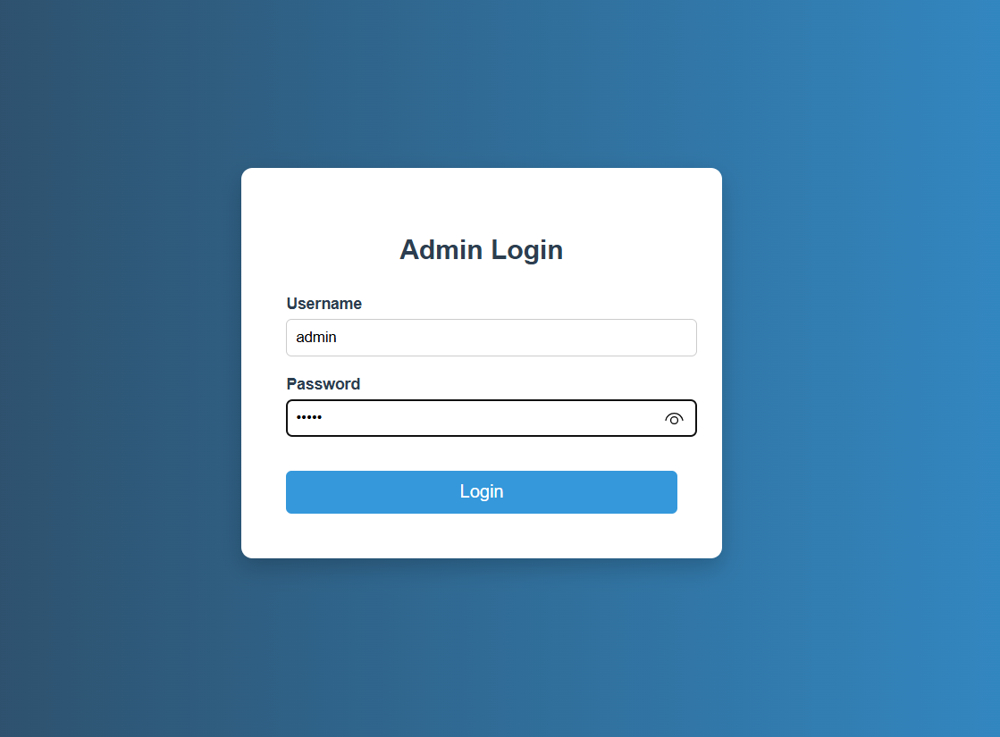
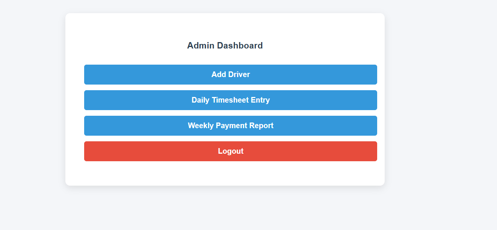
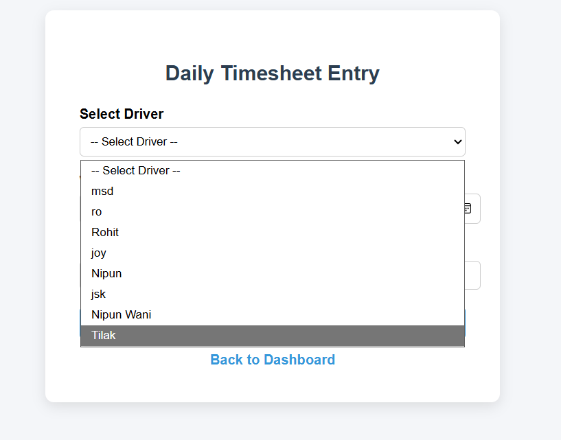
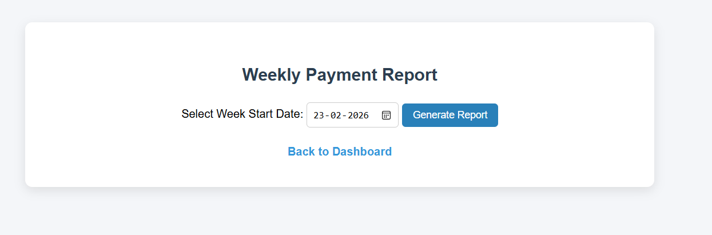
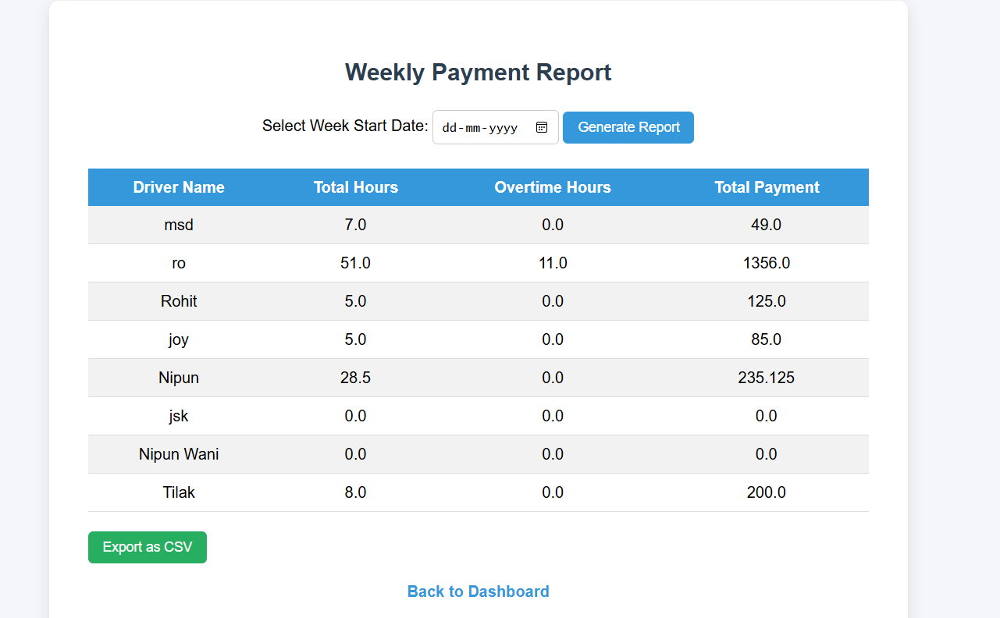

# 🚚 Driver Timesheet and Payroll Calculation System

A web-based application developed to simplify **driver management, daily timesheet tracking, and payroll processing**. The system enables administrators to manage driver records, record daily working hours, and automatically generate weekly payroll reports with overtime calculations, reducing manual effort and improving payroll accuracy.

---

## 📌 Project Overview

The Driver Timesheet and Payroll Calculation System is designed to automate payroll operations by maintaining driver information, recording daily work hours, and calculating weekly salaries based on working hours and overtime. The application provides a centralized platform for managing payroll efficiently while minimizing manual errors.

---

## ✨ Features

- 🔐 Secure Admin Login
- 👨‍💼 Driver Registration & Management
- 🕒 Daily Timesheet Entry
- 📋 View Driver Records
- 📊 Weekly Payroll Generation
- ⏱️ Automatic Overtime Calculation
- 📄 Payroll Report Generation
- 💾 MySQL Database Integration using JDBC

---

## 🛠️ Tech Stack

### Backend
- Java
- Servlets
- JSP
- JDBC

### Frontend
- HTML
- CSS
- JavaScript

### Database
- MySQL

### Server
- Apache Tomcat

### Development Tools
- Eclipse IDE
- MySQL Workbench

---

## 📂 Project Structure

```text
Driver-Timesheet-System
│
├── src
│   ├── controller
│   ├── dao
│   ├── model
│   ├── service
│   └── utility
│
├── WebContent
│   ├── css
│   ├── js
│   ├── images
│   └── jsp
│
├── database.sql
└── README.md
```

---

## ⚙️ Installation & Setup

### Prerequisites

- Java JDK 8 or later
- Apache Tomcat
- MySQL Server
- Eclipse IDE

### Steps to Run

1. Clone the repository.

```bash
git clone https://github.com/Nipun-wani/driver-timesheet-system.git
```

2. Import the project into Eclipse.

3. Create the MySQL database using the provided `database.sql` script.

4. Configure the database connection in the JDBC utility class.

5. Deploy the project on Apache Tomcat.

6. Start the server and access the application.

---

## 📷 Application Screenshots

### 🔐 Login Page



---

### 📊 Dashboard



---

### 👨‍💼 Add Driver


---

### 🕒 Daily Timesheet Entry



---

### 📈 Weekly Payroll Report




---

## 📊 Payroll Calculation

The system automatically generates weekly payroll based on recorded working hours.

- Standard Working Hours: **40 Hours / Week**
- Overtime Rate: **1.5 × Hourly Rate**

### Formula

```text
Regular Pay = Regular Hours × Hourly Rate

Overtime Pay = Overtime Hours × Hourly Rate × 1.5

Total Salary = Regular Pay + Overtime Pay
```

---

## 🎯 Key Learning Outcomes

- Developed a dynamic web application using Java Servlets and JSP.
- Implemented CRUD operations using JDBC and MySQL.
- Applied the MVC (Model-View-Controller) architecture.
- Implemented session-based authentication.
- Designed and managed a relational database.
- Automated payroll calculation using business logic.

---

## 🚀 Future Enhancements

- Spring Boot Migration
- Spring Security Integration
- REST API Development
- JWT Authentication
- Email Payslip Generation
- Dashboard Analytics
- Export Payroll Reports to PDF

---

## 👨‍💻 Author

**Nipun Wani**

GitHub: https://github.com/Nipun-wani

